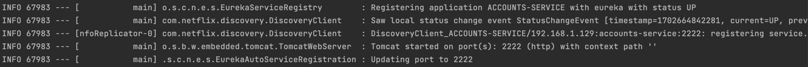
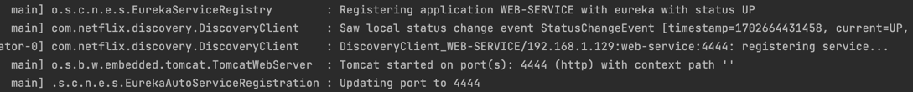
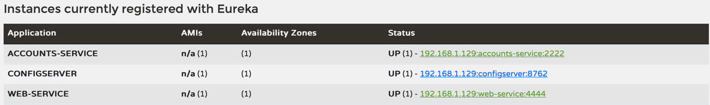
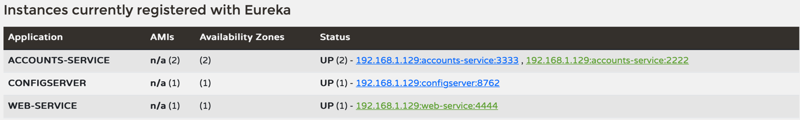
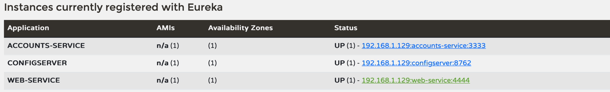

# Report used to explain laboratory 6 - microservice

## Create my own repository based on the laboratory 6 repo
Link to my own configuration repository: https://github.com/adrianchu539/lab6-microservices-config-repo.git

## Register and running two services: accounts(2222) and web 

Here they are the two log screenshots asked:

### Accounts

### Web

## Service registration service in Eureka
Both services: accounts and web are now registered instances in Eureka.

## Change of accounts service port 
I have updated the accounts service port through the configuration repository changing the accounts-service.yml file.

**Link to the commit**: https://github.com/UNIZAR-30246-WebEngineering/lab6-microservices-config-repo/commit/0f3848ac644b48710a7c646a0c9e0a1dbf9ca95f

## Running a second instance of the accounts service
After a second instance of the accounts service, we can see that Eureka dashboard has added both ports (2222 and 3333) to the accounts service application.

## Killing accounts (2222) service and requesting web
After stopping the accounts service running at the 2222 port, Eureka dashboard has been refreshed, showing only the accounts service running at the 3333 port.

If we do a request to web it changes nothing, we can still do requests to web even though we have stopped the service running at 2222 port

## Can the web service provide information about the accounts again?
Yes, as I told at the previous question, even though we have killed the previous accounts service instance, we can still do requests to web.
